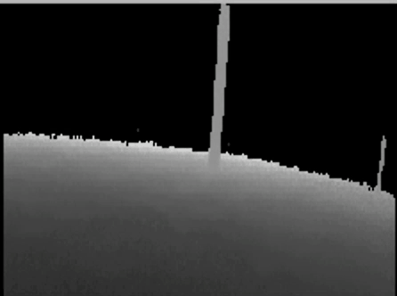
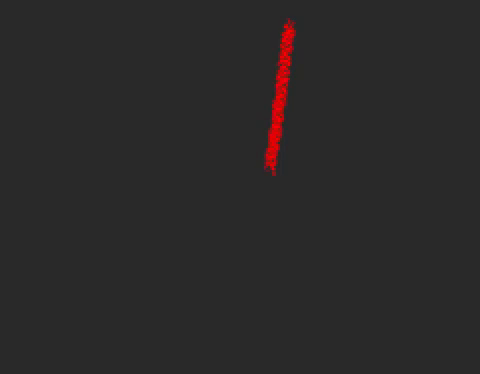
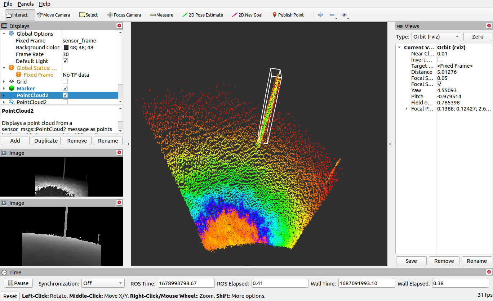

# TreeScan3D-Multi-Threaded-Tree-Detection
TreeScan3D is an innovative project that leverages the power of 3D computer vision and multi-threaded processing for efficient tree detection. Leverages ROS, PCL and C++.

    
    
Depth Map

    
    
Point Cloud

## ⚠️ Dependencies
1) ROS ([Offical Guide](http://wiki.ros.org/noetic/Installation/Ubuntu))
2) PCL ([Offical Guide](https://pointclouds.org/downloads/))

## ⚙️ To Use
1) `catkin build -DCMAKE_BUILD_TYPE=Release`
2) source workspace or `.bashrc` if already added
3) `rosrun detector detectorV2`

## 🎋 3D Bounding Box with instance labelled Point Cloud

    
    
Instance Cloud

    
    
3D Bounding Box

## 🖼️ Visualization
RVIZ can be used to visualize the Bounding Box and the computed instance cloud

    
    
RVIZ Window

